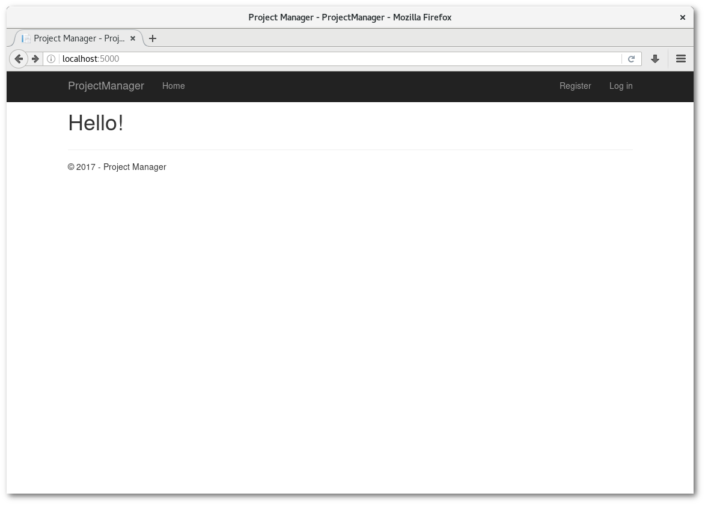
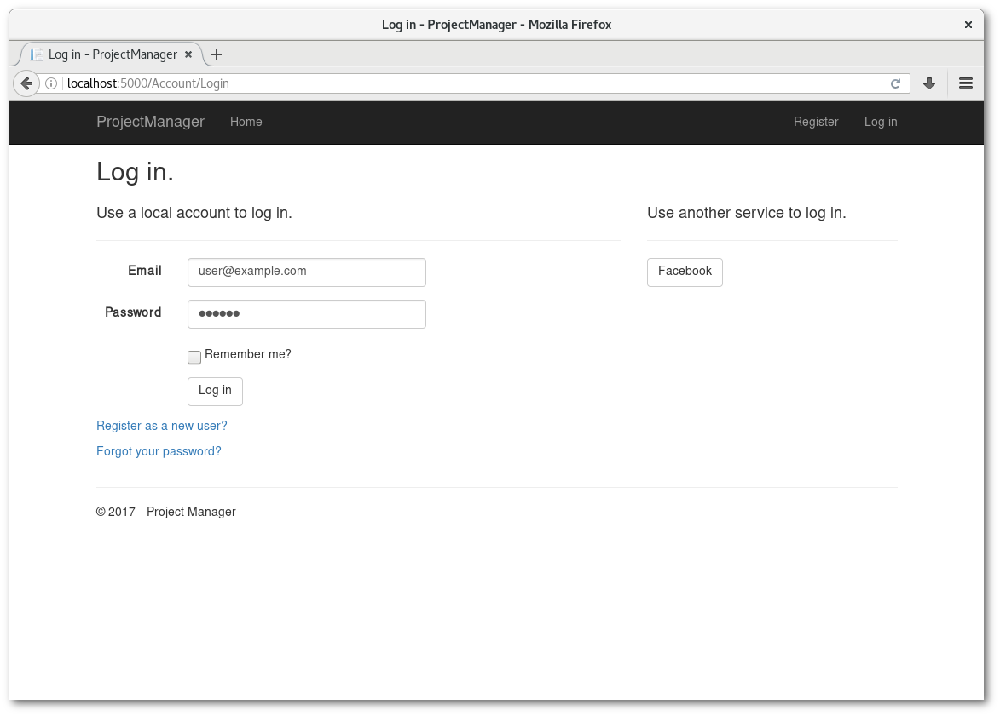
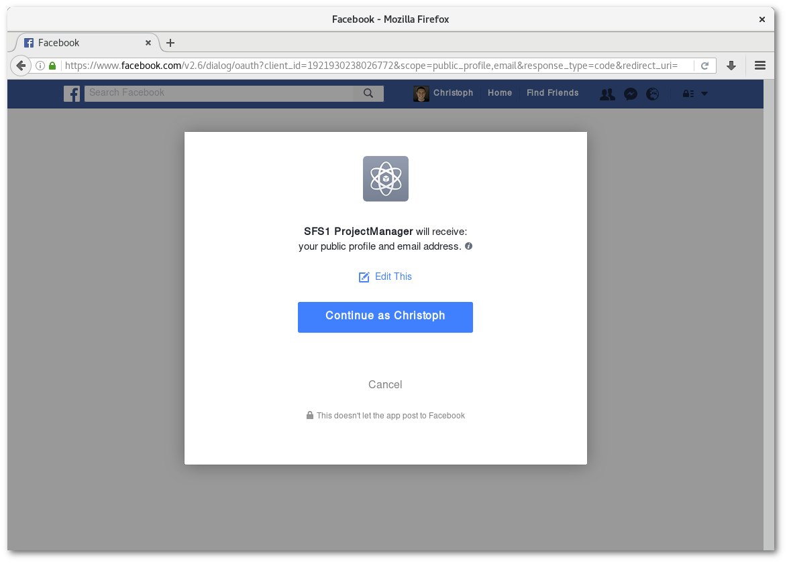
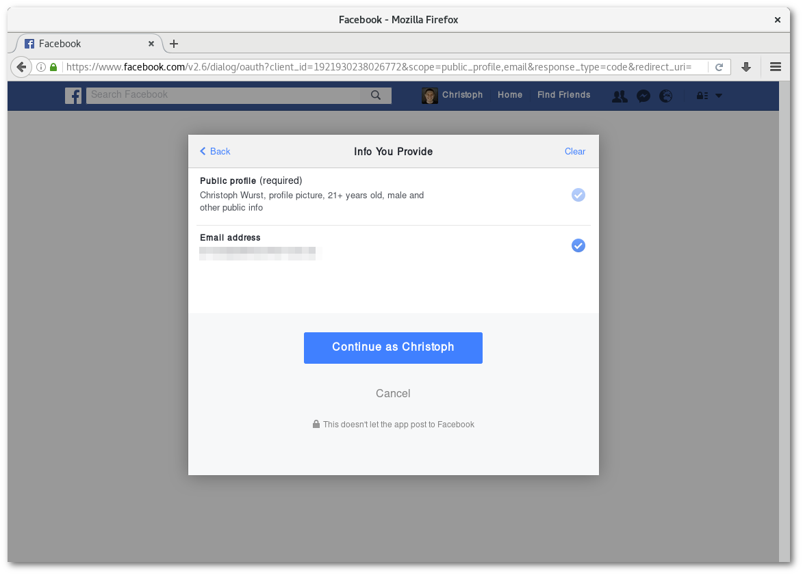
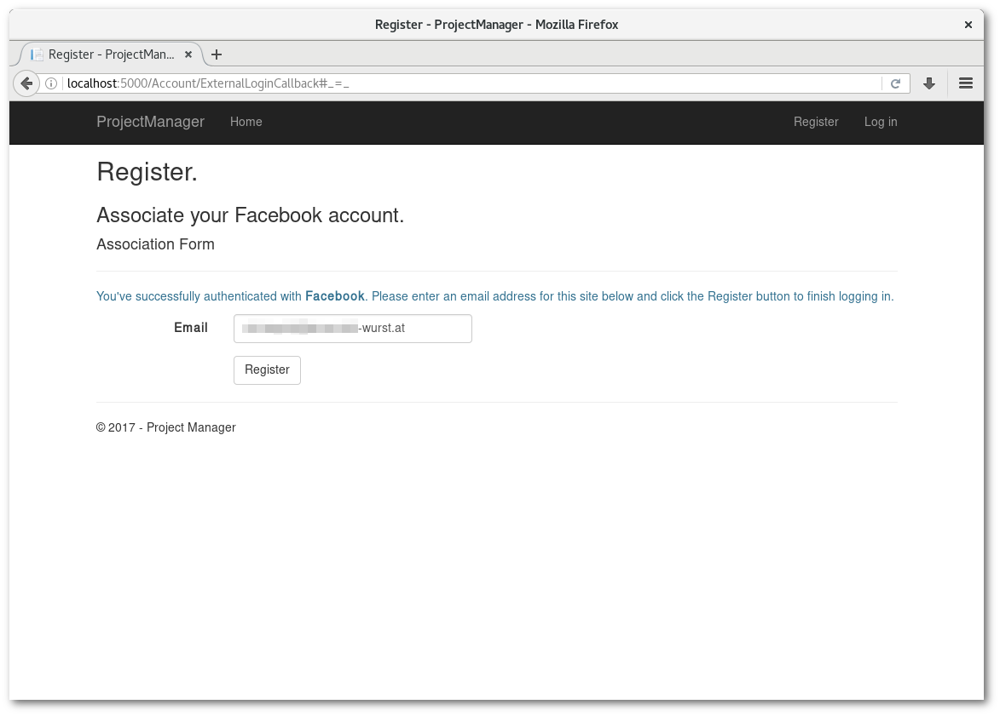
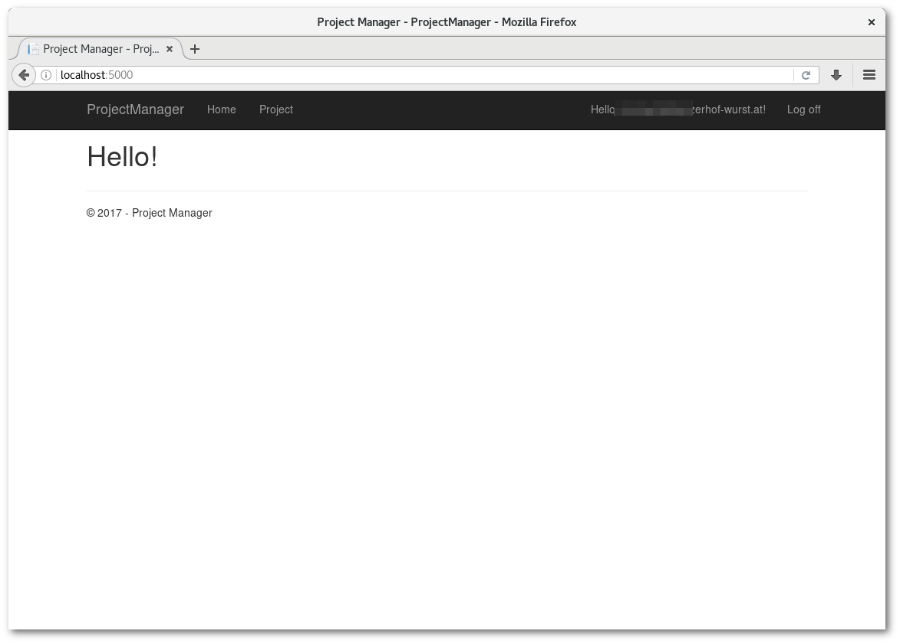
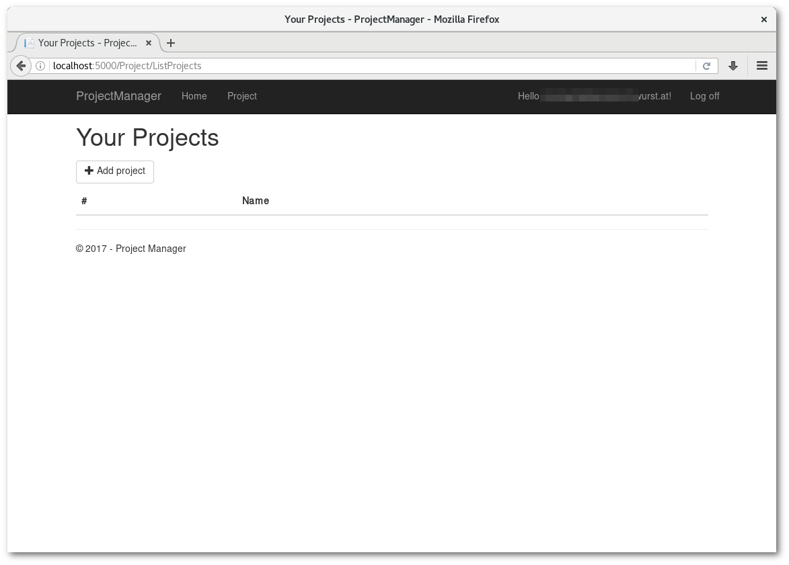

# SFS1 Projekt: Web-App using Claims Identity Security

*Stefan Rösch, Christoph Wurst*, Masterstudiengang Software Engineering,
Hagenberg 2017

Dieses Projekt wurde mit *ASP.NET Core* und *ASP.NET Core Identity* umgesetzt.
Dazu wurde eine einfache Web-App erstellt, die die Verwaltung von Projekten
erlaubt. Dabei werden die CRUD-Operationen durch einen Login und
Authorisierungsrichtlinien geschützt.

---
## Berechtigungen

Folgende Berechtigungen wurden festgelegt:

* Anonymer Zugriff
    * Projekte auflisten
* Angemeldeter Benutzer
    * Projekte auflisten
* Administratoren
    * Projekte auflisten
    * Projekte erstellen
    * Projekte löschen

---
### Definition der Regel

Eine Regel (*Policy*) für Administratoren erlaubt das Referenzieren der
Zugriffsrechte an verschiedenen Orten des Codes. Diese Regel wird in der
[Startup Klasse](../Startup.cs) definiert:

```C#
services.AddAuthorization(options => 
    options.AddPolicy("AdminOnly", policy => policy.RequireClaim("Yolo")));
```

Das bedeutet, dass nur jene Benutzer, die über den "Yolo"-Claim verfügen,
auf Resourcen zugreifen dürfen, die mit "AdminOnly" geschützt sind.

---
### Verwendung im C#-Code

Der [ProjectController](../Controllers/ProjectController.cs) beinhaltet diese
Funktionalität. Der Controller wurde erhält das [``Authorize``-Attribut](https://msdn.microsoft.com/en-us/library/system.web.mvc.authorizeattribute.aspx), wodurch
die Methoden nur von angemeldeten Benutzern aufgerufen werden können. Die
besonders markanten Code-Teile sind

#### [Klassenattribut](https://github.com/ChristophWurst/sfs1_project/blob/f809fe6e301972b3f820e0184a0721a4ca967d92/Controllers/ProjectController.cs#L12)
```C#
    [Authorize]
    public class ProjectController : Controller
```
#### [Attribute der Methoden](https://github.com/ChristophWurst/sfs1_project/blob/f809fe6e301972b3f820e0184a0721a4ca967d92/Controllers/ProjectController.cs#L43)
```C#
    // GET Project/AddProject
    [HttpGet]
    [Authorize(Policy = "AdminOnly")]
    public async Task<IActionResult> AddProject()
    {
        return View();
    }
```

---
### Verwendung in Razor-Views

Auch [in den Views](../Views/Project/ListProjects.cshtml) wird auf die Policy zugegriffen, wenn entschieden wird, ob der aktuelle Benutzer gewisse Teile der Seite sehen soll oder nicht:
```C#
@if (await AuthorizationService.AuthorizeAsync(User, "AdminOnly")) {
<p>
    <a class="btn btn-default" asp-action="AddProject">
        <span class="glyphicon glyphicon-plus"></span> 
        Add project</a>
</p>
}
```

---
## Externer Identity Provider

Als externer *Identity Provider* wurde Facebook gewählt. Über diesen soll es
Benutzern möglich sein, sich anzumelden. Das System entscheidet je nach Claims
des Facebook IdPs, welche Claims im System gewährt werden.

---
### Provider aktivieren

Der Provider wird in [Startup.cs definiert](https://github.com/ChristophWurst/sfs1_project/blob/f809fe6e301972b3f820e0184a0721a4ca967d92/Startup.cs#L84-L88):
```C#
    app.UseFacebookAuthentication(new FacebookOptions()
    {
        AppId = Configuration["Authentication:Facebook:AppId"],
        AppSecret = Configuration["Authentication:Facebook:AppSecret"]
    });
```

Der Provider registriert spezielle *Middlewares*, die Requests zur externen Anmeldung
bearbeiten.

---
### Claims Transformation

Um die Berechtigungen des externen IdP auf die des Systems zu übersetzen, werden
die Claims *on the fly* zur Laufzeit zugewiesen. Dazu wird die Klasse 
[ClaimsTransformer](..(/Services/ClaimsTransformer.cs)) verwendet. Diese
überprüft die Claims, die von Facebook geliefert werden, und leitet daraus
die Berechtigungen für Projekte ab.

Hier wird eine ganz einfache Überprüfung durchgeführt, bei der die Benutzer
je nach E-Mail-Domain Schreib- und Löschrechte bekommen:

```C#
public class ClaimsTransformer : IClaimsTransformer
{
    public Task<ClaimsPrincipal> TransformAsync(ClaimsTransformationContext context)
    {
        if (context.Principal.Claims.Any(c =>
        {
            return c.Type == "http://schemas.xmlsoap.org/ws/2005/05/identity/claims/name"
                     && c.Value.EndsWith("@winzerhof-wurst.at");
        }))
        {
            ((ClaimsIdentity)context.Principal.Identity).AddClaim(new Claim("Yolo", "true"));
        }
        return Task.FromResult(context.Principal);
    }

}
```

Diese Klasse muss [in Startup.cs definiert werden](https://github.com/ChristophWurst/sfs1_project/blob/f809fe6e301972b3f820e0184a0721a4ca967d92/Startup.cs#L80-L83):
```C#
    app.UseClaimsTransformation(new ClaimsTransformationOptions
    {
        Transformer = new ClaimsTransformer()
    });
```

---
## Demonstration

Ist man nicht angemeldet, wird der Link zur Projektübersicht nicht angezeigt.


---
### Anmeldung über Facebook
Neben dem Login für lokale Benutzer erscheint ein Button für den Facebook-Login.


---
### Umleitung auf Facebook
Benutzer werden anschließend auf Facebook umgeleitet, um zu bestätigen, dass
persönliche Information an die Web-App übergeben wird.


---
Hier kann man kontrollieren, welche Daten übermittelt werden.


---
### Umleitung zur Web-App
Sobald Benutzer die App erlauben, leitet Facebook sie zurück zur Web-App. Dort
müssen sie noch ihre E-Mail-Adresse bestätigen. Anschließend wird ein Benutzer-
account in der Datenbank angelegt.


---
### Angemeldeter Zustand
Da die Benutzer nun angemeldet sind, sehen sie den Link zur Projektübersicht.


---
### Projektverwaltung
Durch die verwendete E-Mail-Adresse auf Facebook wird erkannt, dass es sich um
einen Administrator handelt. Dieser darf Projekte hinzufügen, deshalb wird ein
entsprechender Button angezeigt.


---
## Nützliche Links
* [ASP.NET Core](https://docs.microsoft.com/en-us/aspnet/core/)
* [ASP.NET Core Identity](https://docs.microsoft.com/en-us/aspnet/core/security/authentication/identity)
* [Enabling authentication using Facebook, Google and other external providers
](https://docs.microsoft.com/en-us/aspnet/core/security/authentication/social/index)
* [Claims Transformation and Authorization Policy in ASP.NET Core / MVC 6](https://weblogs.asp.net/imranbaloch/claims-transformation-and-authorization-policy-in-aspnet5-mvc6)
* [Facebook Developer](https://developers.facebook.com/)
